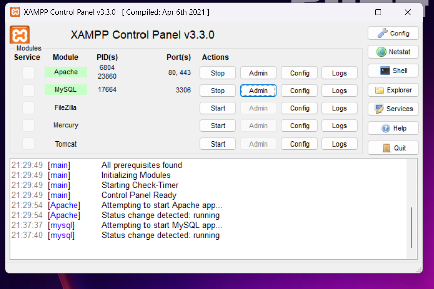
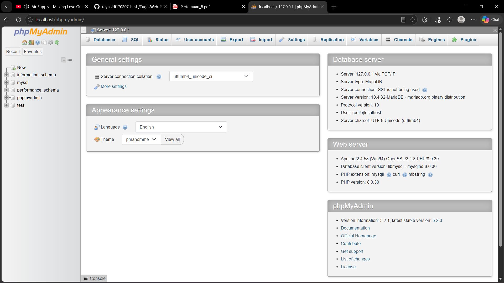
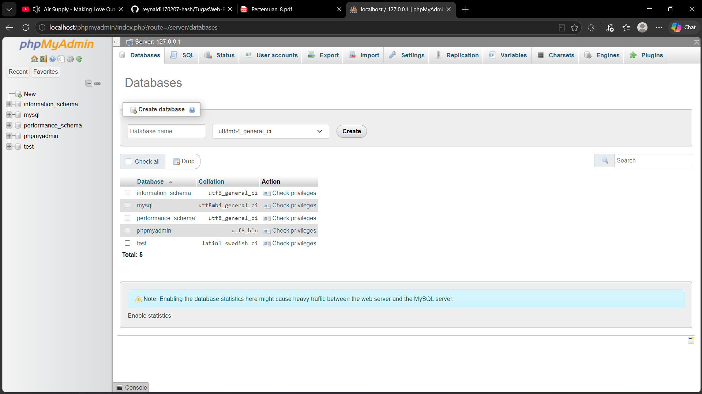
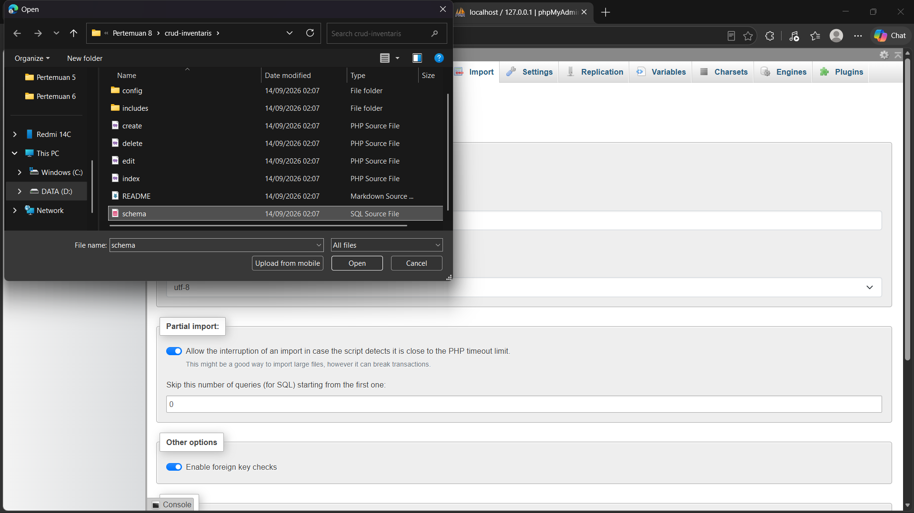
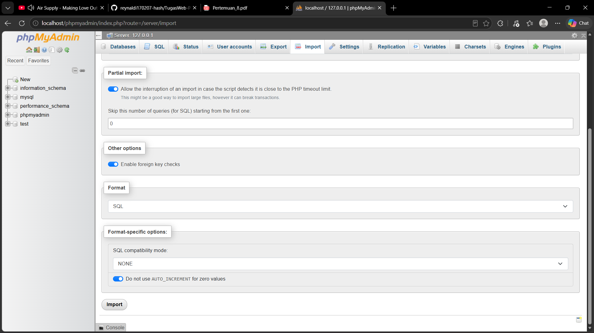
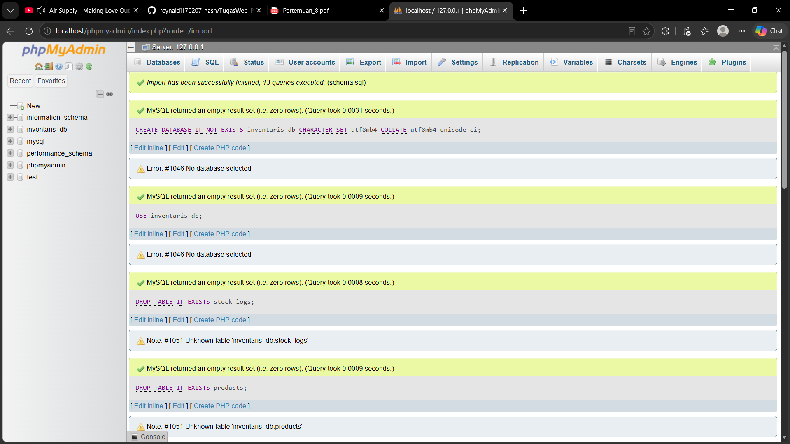
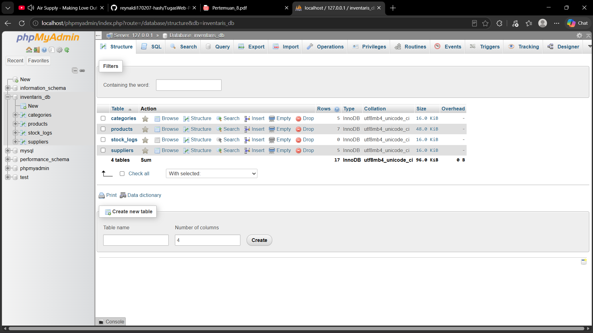

# Langkah Setup Database

## 1. Jalankan XAMPP

Buka **XAMPP Control Panel**, kemudian klik **Start** pada **Apache** dan **MySQL**.



---

## 2. Buka phpMyAdmin

Buka browser, lalu akses:

```text
http://localhost/phpmyadmin/
```

Kemudian klik menu **Databases**.



---

## 3. Buat Database

Pada bagian **Create database**, masukkan nama:

```text
inventaris_db
```

Kemudian pilih:

```text
utf8mb4_unicode_ci
```

Lalu klik **Create**.



---

## 4. Pilih Database

Klik **inventaris_db** pada bagian sidebar phpMyAdmin.



---

## 5. Import `schema.sql`

Klik menu **Import**, kemudian klik **Choose File** dan pilih file `schema.sql`.



Setelah file dipilih, scroll ke bagian bawah dan klik **Import**.


---

## 6. Pastikan Import Berhasil

Jika proses import berhasil, akan muncul pesan:

```text
Import has been successfully finished
```



---

## 7. Periksa Tabel Database

Setelah import selesai, buka database **inventaris_db**.

Pastikan terdapat tabel:

- `categories`
- `products`
- `stock_logs`
- `suppliers`


